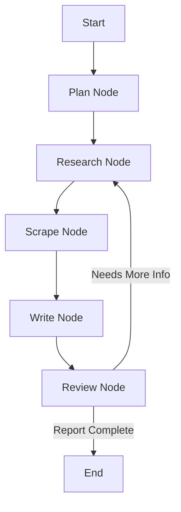

# Agentic Researcher

A fully autonomous, verifiable research agent powered by **LangGraph**, **Mistral AI**, and **Chainlit**. 

Agentic Researcher doesn't just "chat"—it plans, searches the live web, scrapes valid sources, builds a local knowledge base, writes comprehensive technical reports, and self-corrects its own work before presenting it to you.

---

## 🚀 Key Features

* **🧠 Autonomous Planning:** Breaks down complex user queries into specific, researchable sub-topics.
* **🔄 Self-Correcting Loop:** Includes a "Review Node" that evaluates the quality of the report. If the data is insufficient, it autonomously loops back to do more research.
* **🕸️ Interactive Knowledge Graphs:** Automatically extracts entities (technologies, organizations, concepts) and generates an interactive HTML network graph to visualize connections.
* **📄 PDF Report Generation:** Produces professional PDF reports with citations and metadata.
* **📚 RAG-based Q&A:** After research is complete, the agent switches to "Expert Chat Mode," allowing you to ask follow-up questions based strictly on the collected data.
* **🛡️ Quality Filters:** Automatically filters out low-quality sources (social media, spam) and uses fallback mechanisms for scraping failures.

## 🛠️ Technical Architecture

The system is built on a cyclic graph architecture using **LangGraph**:



## Project Structure
```agentic-researcher/
├── app.py              # Main Chainlit application entry point
├── agent_graph/        # Core logic
│   ├── graph.py        # LangGraph definition & workflow
│   ├── nodes.py        # The specific functions (Plan, Research, Write, etc.)
│   ├── states.py       # Pydantic/TypedDict state definitions
│   └── global_state.py # Singleton for ChromaDB persistence
├── utils/
│   ├── pdf_gen.py      # PDF generation logic (xhtml2pdf)
│   └── graph_viz.py    # Knowledge graph generation (NetworkX/Pyvis)
├── tools/
│   ├── search.py       # Serper API wrapper
│   └── scraper.py      # Browserless API wrapper
└── requirements.txt    # Project dependencies
```

## ⚙️ Setup Instructions

Follow these steps to set up the project locally.

### 1. Clone the Repository
```bash
git clone https://github.com/nitesh-77/Agentic-Researcher.git
```
### 2. Create a Virtual Environment
```bash
# Create a new conda environment 
conda create -n research-agent python=3.10 -y

# Activate the environment
conda activate research-agent
```

### 3. Install the required packages
```bash
pip install -r requirements.txt
```

### 4. Configure API keys
Rename the environment file: Change the template file `example.env` to `.env`

Add your API Keys:
```bash
MISTRAL_API_KEY=your_mistral_api_key_here
SERP_API_KEY=your_serper_dev_key_here
BROWSERLESS_API_KEY=your_browserless_io_key_here
```
### 5. Run the application
`chainlit run app/app.py`